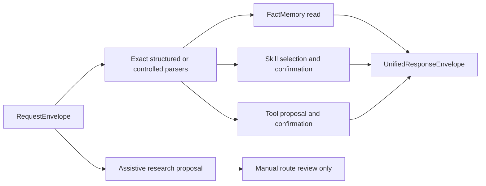

# M-27 Unified Router Architecture

The trusted router is a CPU-only layer above the frozen Stage-1 executor, SkillRegistry v3, and FactMemory v3. One `RequestEnvelope` produces one `RouteDecision` in exactly one authority domain.

Trusted code lives in `ai_brain.stage2.router`. Research code lives in `ai_brain.stage2.router_research` and is not imported by the trusted package. Route decisions bind FactMemory, SkillRegistry, RuleMemory, ToolRegistry, Stage-1, and Stage-2 versions and hashes. A changed dependency invalidates confirmation or execution.

The precedence policy is explicit: a structured source kind validates only its declared schema; controlled parsers run independently; multiple complete parses clarify; one typed missing field clarifies; no complete parse is unsupported. Assistive text never creates exact authority.
